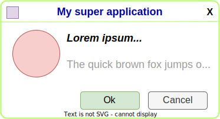
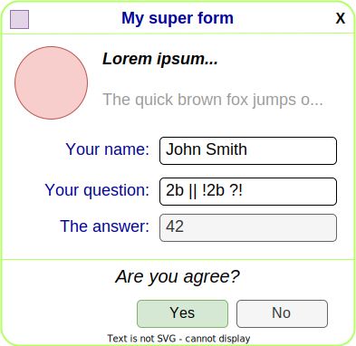
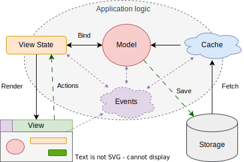
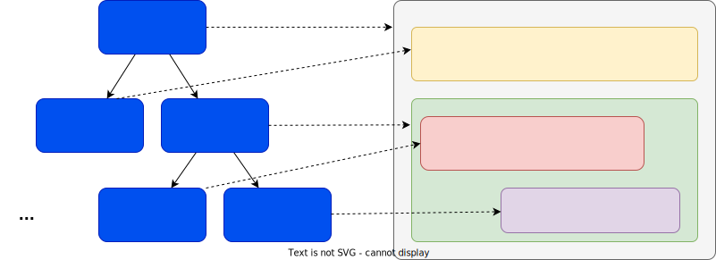

# UI-Фреймворки и Функционально-Реактивное Программирование

## Введение

В этой статье будут рассматриваться вопросы устройства UI-фреймворков, их архитектура и детали реализации. Одной из интересных тем является большая роль идей функционально-реактивного программирования при реализации UI-фреймворков. К концу рассмотрим плюсы и минусы отдельных идей и подходов, применяемых в существующих популярных фреймворках.

Ограничимся рассмотрением только графических UI, которые правильнее называть GUI, но в статье будет применяться аббревиатура UI.

_*Не будут*_ рассматриваться такие интересные темы как Server-Side Rendering (SSR) и Backend-driven UI для простоты изложения. При этом, некоторые мысли будут применимы к UI-фреймворкам, работающим с применением этих подходов.

Графические UI, которые будут здесь описаны, являются частью _клиентских приложений_, предназначенных не для простого отображения и проброса пользовательских действий на обработку на сервер, а имеющих своё локальное состояние редактируемых данных. По большей части они рассчитаны быть достаточно интерактивными и динамичными, но не настолько, как в видеоиграх.

UI можно рассмотреть с трёх сторон:

- как его понимает пользователь
- как его понимает разработчик
- какая математика есть в его основе

Это перекликается с тем, что к разработке UI-фреймворка можно применить тот же принцип DDD (Domain-Driven Design), как и для разработки целого приложения. Можно выделить:

- **домен** - то как понимает UI пользователь
- **реализация** - то, как разработчик представляет поведение UI, выраженное в деталях работы целевой платформы
- **паттерны**, **парадигмы**, **архитектура** - абстракции, которые повторяются от фреймворка к фреймворку

Все UI-фреймворки повторяют:

- **Компонентный** подход
- Отделение **View State** от логики **View**
- **Стили** для описания правил отображения View
- Логика обновления View через **реактивное программирование**
- Все изменения данных - через применение **actions** к View State
- **Асинхронная обработка событий**, неблокирующее исполнение
- **Декларативное программирование** с применением DSL

В существующих популярных фреймворках эти вещи реализуются и совмещаются между собой в тем или иным успехом.

## Доменная модель UI

С точки зрения _домена_, любой UI - это некоторое дерево связанных между собой узлов с определённой семантикой элементов пользовательского интерфейса, правилами отображения на экране и реакциями на взаимодействие с пользователем:

- **Структура** - семантическая древовидная структура элементов UI
- **Стили** - правила для отображения отдельных элементов и фрагментов UI в зависимости от контекста
- **Поведение** - возможности для совершения действий пользователем и реакция на них

Структура UI - это семантическое дерево, основанное на структуре данных, с которыми работает пользователь. Эти данные обычно называют _моделью_, или _состоянием_ (state). UI дополняет эту модель удобными возможностями для просмотра и редактирования, образуя своё _состояние представления_ (view state).

Стили - это не только CSS. К стилизации можно отнести и более сложные правила трансформации структуры UI в _представление_ (view).

Поведение UI исходит из поведения модели из предметной области и дополняется логикой поведения элементов, которые относятся только к представлению. Логика поведения обычно описывается как реакции на взаимодействия. К инициаторам взаимодействия относятся:

- пользовательские действия (actions)
- события (events), происходящие в самой системе (например, таймеры, завершение загрузки и т.п.)

Реакции могут быть сложными, по завершению одних реакций могут запускаться другие. UI может проходить через целую последовательность состояний, которую можно описать автоматной моделью той или иной сложности. Движение по графу переходов управляется событиями и действиями и может быть синхронными и асинхронным. Отдельные части UI могут исполнять реакции параллельно.

Модель, которая редактируются с помощью UI - это не просто state, состоящий из примитивных сгруппированных данных. Некоторые данные могут быть отражением других данных. Например, данные на UI могут быть лишь отражением данных на сервере.

Похожим образом устроены все UI-фреймворки для клиентских приложений: Web, Desktop, Mobile. Фреймворки повторяют одни и те же идеи архитектуры, но реализация может существенно различаться.

### Компонентный подход

Пользователь мыслит UI в структурированном виде, может разделять его на независимые логические блоки, выделять повторно используемые блоки, представлять правила, по которым применяются стили и интуитивно предсказывать поведение. Компонентный подход позволяет определять структуру UI, привязывая к ней всё остальное - стили и поведение.

Компонент - это абстрактная единица, которая совмещает в себе часть структуры UI, связанные с ней локальные стили и логику поведения. Можно сказать, что это маленький фрагмент самостоятельного полноценного UI, который можно повторно использовать как шаблон, меняя в нём изменяемые параметры. Также, компоненты проектируются так, чтобы их можно было совмещать друг с другом. Обычно прим

Компоненты в первую очередь позволяют выстроить блоки UI в дерево путём композиции.

### Выделение View State от логики представления

Представление (View) реализуется по возможности как пассивная структура примитивных элементов UI без какой-либо сложной организации данных состояния. Оно предоставляет лишь механизм для взаимодействия с отрисовкой и обработку ввода в виде примитивных событий. При этом логика работы UI подразумевает наличие состояния, которое можно организовать определённым образом, опираясь на предметную область и структуру представления.

### Стили

### Реактивное программирование

### Операции редактирования

### Асинхронная обработка событий

### Декларативное программирование

## Сила абстракций

Когда требуется декларативное программирование со строгими абстракциями, классический подход с императивным ООП уже не подходит.

### Проблемы JavaScript для разработки UI

JavaScript как он есть не подходит для удобной разработки логики UI, потому что имеет ряд проблем:

- мало средств для создания строгих абстракций
- ограничения синтаксиса не позволяют выражать логику достаточно декларативно
- трудно корректно типизировать с помощью TypeScript
- из коробки не позволяет следовать парадигмам функционального и реактивного программирования

Тем не менее, он не достаточно "плох", чтобы отказаться от его использования. Тем более, для браузера альтернатив почти нет.

JavaScript - это императивный ООП с замыканиями. Это ни в коем случае не язык функционального программирования. То, что в нём можно писать в "функциональном стиле" не делает его языком с парадигмой функционального программирования. Потому что сам язык предоставляет мало средств, чтобы придерживаться функциональной парадигмы. И часто в итоге получается, что "функциональный стиль" JavaScript держится лишь на соглашениях и на совести разработчиков. Потому что из-за всех возможностей JavaScript соблюдение этих соглашений трудно проверить типизацией и статическим анализом без существенного ограничения языка.

Тем не менее, в JavaScript, как и во многих языках с ООП, есть средства для обеспечения гарантий выполнения некоторых абстракций. Во-первых, есть возможности const-переменных, неизменяемых полей и getters без setters. Во-вторых, есть способы строгой инкапсуляции, которые с развитием современного JavaScript становятся всё удобнее. Это отсутствие доступа к локальным переменным и параметрам замыканий, ES-модули и приватные поля классов. С помощью этих элементарных средств ограничения становится возможным делать слои сильных абстракций, но на это надо потратить много усилий при разработке, чтобы не допустить "дыру" или "протечку" в абстракции.

Ещё JavaScript как он есть не позволяет выполнять сложные оптимизации над кодом. Оптимизаторы, чтобы выполнить некоторые полезные и очевидные оптимизации типа минификации, инлайнинга и удаления неиспользуемого кода, пользуются предположениями том, что код проекта написан определённым образом и не содержит хитрых хаков. И если код написан в более строгих соглашениях, позволяющих куда более эффективные оптимизации, оптимизаторы это сделать не могут, потому что эти соглашения не гарантированы и их в принципе трудно проверить статическим анализом.

### Шаблоны и DSL

Декларативный DSL представляется как язык, на котором можно в _формальном_ (строгом) виде выразить мысль так, что по структуре код будет напоминать неформальное описание задачи и её решения на естественном языке или псевдокоде. JavaScript в связке с TypeScript даёт много мощных средств для создания строгих DSL, но их не достаточно.

Большинство существующих фреймворков так или иначе делают свой DSL на JS или свой DSL шаблонов с вкраплением JS. Мало фреймворков, которые используют свой честный DSL шаблонов со строгими гарантиями.

## Вопросы реализации UI

Можно выделить несколько групп вопросов реализации UI-фреймворка:

- Декларативный DSL, его парсинг и интерпретация
- работа с целевой платформой
- реактивное программирование как логика обновления представления при обновлении состояния

### DSL

Два подхода к реализации фреймворка:

- Frameworkless - снизу вверх, сборка из элементарных библиотек с максимальным прямым использованием средств платформы
- Сверху вниз, начиная с создания своего языка и сильных абстракций с минимизацией прямого обращения к средствам платформы

Примерно такое же разделение отражается в способах проектирования DSL:

- Взять элементарные возможности платформы и способ их композиции, построить DSL как библиотеку для универсального языка
- Спроектировать DSL исходя из домена, а затем задуматься о реализации на целевой платформе, построить DSL как транслятор

### Целевая платформа UI

Обычно, это почти такое же дерево элементов с семантикой UI, но с меньшими возможностями и нехваткой декларативности.

Иногда это просто движок отрисовки графической сцены и обработки в вода. К нему нужно добавить реализацию layout и применения стилей, обработку событий. В итоге получится примерно то же, что и DOM.

Но можно в качестве целевой платформы использовать и другой UI-фреймворк.

### Реализация реактивности во фреймворках

Задача в том, чтобы при изменении модели или view state выполнить необходимые изменения view средствами целевой платформы.

View state может обновляться разными способами:

- точечные изменения значений
- изменения структуры дерева данных
- замена больших фрагментов данных на новые

Целевая платформа тоже может предоставлять API для изменения состояния UI различными способами:

- точечные изменения элементов UI или примитивов сцены
- Замена фрагментов
- полная перерисовка экрана

Реализации реактивности можно разделить по моменту, когда выполняется reconciliation:

- fine-graned reactivity
- vDOM reconciliation
- полная перерисовка экрана

Fine-graned reactivity может строиться по push- и pull-модели.

### Реактивность самого DOM

CSS reflow
CSS variables

### Компиляция шаблонов

## Ставка на fine-graned reactivity