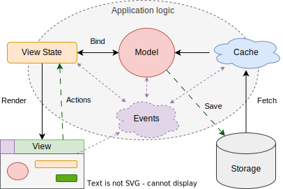

# UI-фреймворки и функционально-реактивное программирование

## Введение

В этой статье будут рассматриваться вопросы устройства UI-фреймворков, их архитектура и детали реализации. Одной из интересных тем является большая роль идей функционально-реактивного программирования при реализации UI-фреймворков.

Ограничимся рассмотрением только графических UI, которые правильнее называть GUI, но в статье будет применяться аббревиатура просто UI.

_*Не будут*_ рассматриваться такие интересные темы как Server-Side Rendering (SSR) и Backend-driven UI для простоты изложения. При этом, некоторые мысли будут применимы к UI-фреймворкам, работающим с применением этих подходов.

Графические UI, которые будут здесь описаны

UI можно рассмотреть с трёх сторон:

- как его понимает пользователь
- как его понимает разработчик
- какая математика есть в его основе

Это перекликается с тем, что к разработке UI-фреймворка можно применить тот же принцип DDD (Domain-Driven Design), как и для разработки целого приложения. Можно выделить:

- **домен** - то как понимает UI пользователь
- **реализация** - то, как разработчик представляет поведение UI, выраженное в деталях работы целевой платформы
- **паттерны**, **парадигмы**, **архитектура** - абстракции, которые повторяются от фреймворка к фреймворку

### Домен UI

С точки зрения _домена_, любой UI - это некоторое дерево с определённой семантикой, правилами отображения на экране и взаимодействия с пользователем:

- **Структура** - семантическая древовидная структура элементов UI
- **Стили** - правила для отображения отдельных элементов и фрагментов UI в зависимости от контекста
- **Поведение** - возможности для совершения действий пользователем и реакция на них

Структура UI - это семантическое дерево, основанное на структуре данных, с которыми работает пользователь. Эти данные обычно называют _моделью_, или _состоянием_ (state). UI дополняет эту модель удобными возможностями для просмотра и редактирования, образуя своё _состояние представления_ (view state).

Стили - это не только CSS. К стилизации можно отнести и более сложные правила трансформации структуры UI в _представление_ (view).

Поведение UI исходит из поведения модели с точки зрения предметной области и дополняется логикой поведения элементов, которые относятся только к представлению. Логика поведения обычно описывается как реакции на взаимодействия. К инициаторам взаимодействия относятся:

- пользовательские действия (actions)
- события (events), происходящие в самой системе (например, таймеры, завершение загрузки и т.п.)

Реакции могут быть сложными, по завершению одних реакций могут запускаться другие. UI может проходить через целую последовательность состояний, которую можно описать автоматной моделью той или иной сложности. Движение по графу переходов управляется событиями и действиями и может быть синхронными и асинхронным. Отдельные части UI могут исполнять реакции параллельно.

Модель, которая редактируются с помощью UI - это не просто state, состоящий из примитивных сгруппированных данных. Некоторые данные могут быть отражением других данных. Например, данные на UI могут быть лишь отражением данных на сервере.

Похожим образом устроены все UI-фреймворки для клиентских приложений: Web, Desktop, Mobile. Фреймворки повторяют одни и те же идеи архитектуры, но реализация может существенно различаться.

Все UI-фреймворки повторяют:

- Компонентный подход
- Выделение View State от логики представления
- Обновление View через реактивное программирование
- Все изменения данных - через применение actions к View State
- Асинхронная обработка событий, неблокирующая логика
- Декларативное программирование
