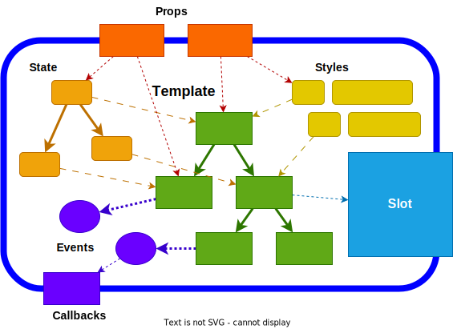

# UI-Фреймворки, Декларативный подход и Реактивное программирование

## Введение

В этой статье будут рассматриваться вопросы устройства UI-фреймворков, их архитектура и детали реализации. Одной из интересных тем является большая роль идей функционально-реактивного программирования при реализации UI-фреймворков. К концу рассмотрим плюсы и минусы отдельных идей и подходов, применяемых в существующих популярных фреймворках.

Ограничимся рассмотрением только графических UI, которые правильнее называть GUI, но в статье будет применяться аббревиатура UI.

_*Не будут*_ рассматриваться такие интересные темы как _*Server-Side Rendering*_ (SSR) и _*Backend-driven UI*_ для простоты изложения. При этом, некоторые мысли будут применимы и к UI-фреймворкам, работающим с применением этих подходов, например, стилизация.

Графические UI, которые будут здесь описаны, являются частью _клиентских приложений_, имеющих своё локальное состояние редактируемых данных. То есть, не будут рассматриваться совсем "тонкие клиенты", отвечающие только за простое отображение элементов и проброс пользовательских действий на обработку на сервер. По большей части будем рассматривать клиентские приложения, рассчитанные быть достаточно интерактивными и динамичными, но не настолько, как в видеоиграх.

UI можно рассмотреть с трёх сторон:

- как его понимает **пользователь**
- как его понимает **разработчик**
- какая **математика** есть в его основе

Это перекликается с тем, что к разработке UI-фреймворка можно применить тот же принцип DDD (Domain-Driven Design), как и для разработки целого программного продукта. Можно выделить:

- **домен** - то как понимает UI пользователь
- **реализация** - то, как разработчик представляет поведение UI, выраженное в деталях работы целевой платформы
- **паттерны**, **парадигмы**, **архитектура** - абстракции, которые повторяются от фреймворка к фреймворку

Все UI-фреймворки во многом похожи и повторяют:

- **Компонентный** подход
- Отделение **View State** от логики **View**
- **Стили** для описания правил отображения View
- Логика обновления View через **реактивное программирование**
- Логика изменения данных через применение **actions**
- **Асинхронная обработка событий**, неблокирующее исполнение
- **Декларативное программирование** с применением DSL

В существующих популярных фреймворках эти вещи реализуются и совмещаются между собой в тем или иным успехом.

## Доменная модель UI

С точки зрения _домена_, любой UI - это некоторое дерево связанных между собой узлов с определённой семантикой элементов пользовательского интерфейса, правилами отображения на экране и реакциями на взаимодействие с пользователем:

- **Структура** - семантическая древовидная структура элементов UI
- **Стили** - правила для отображения отдельных элементов и фрагментов UI в зависимости от контекста
- **Поведение** - возможности для совершения действий пользователем и реакция на них

Структура UI - это семантическое дерево, основанное на структуре данных, с которыми работает пользователь. Эти данные обычно называют _моделью_, или _состоянием_ (state). UI дополняет эту модель удобными возможностями для просмотра и редактирования, образуя своё _состояние представления_ (view state).

Стили - это не только CSS. К стилизации можно отнести и более сложные правила трансформации структуры UI в _представление_ (view).

Поведение UI исходит из поведения модели из предметной области и дополняется логикой поведения элементов, которые относятся только к представлению. Логика поведения обычно описывается как реакции на взаимодействия. К инициаторам взаимодействия относятся:

- пользовательские действия (actions)
- события (events), происходящие в самой системе (например, таймеры, завершение загрузки и т.п.)

Реакции могут быть сложными, по завершению одних реакций могут запускаться другие. UI может проходить через целую последовательность состояний, которую можно описать автоматной моделью той или иной сложности. Движение по графу переходов управляется событиями и действиями и может быть синхронным и асинхронным. Отдельные части UI могут исполнять реакции параллельно.

Модель, которая редактируются с помощью UI - это не просто state, состоящий из примитивных сгруппированных данных. Некоторые данные могут быть отражением других данных. Например, данные на UI могут быть лишь отражением данных на сервере.

Похожим образом устроены все UI-фреймворки для клиентских приложений: Web, Desktop, Mobile. Фреймворки повторяют одни и те же идеи архитектуры, но реализация может существенно различаться.

### Компонентный подход

Пользователь мыслит UI в структурированном виде, может разделять его на независимые логические блоки, выделять повторно используемые блоки, представлять себе правила, по которым применяются стили и интуитивно предсказывать поведение при взаимодействии с некоторыми элементами. Компонентный подход позволяет определять структуру UI, привязывая к ней всё остальное - правила отображения и поведение.

**Компонент** - это абстрактная единица, которая совмещает в себе часть структуры UI, связанные с ней локальные стили и логику поведения. Можно сказать, что это самостоятельный блок полноценного UI, который можно повторно использовать как шаблон, меняя в нём изменяемые параметры. Использование компонента происходит путём создания его **экземпляра**. Экземпляров одного компонента может быть много, они могут быть созданы с различными параметрами и присутствовать в разных местах структуры UI.

Компоненты в первую очередь позволяют выстроить блоки UI в дерево путём композиции, определяя семантическую структуру UI.

Далее, компоненты отвечают за свою локальную логику применения стилей - не только inline-стилей, но и композицию общих повторно используемых стилей, связанных, например, с темой оформления и дизайн-системой.

И, наконец, компоненты отвечают за реализацию логики поведения - реакцию на события и изменения данных.

Компоненты проектируются так, чтобы их можно было совмещать друг с другом. Обычно это происходит путём **композиции**. Каждый компонент может быть рассчитан как с целью быть вставленным куда угодно в произвольный контекст, так и с целью принять внутрь себя другие произвольные компоненты. Композиции подвергается как структура UI-элементов, так и стили и логика поведения.

При грамотном проектировании компонентов каждый компонент наделяется одной _обязанностью_ (Single Responsibility). Обязанность отдельных компонентов даже может заключаться _только_ в формировании структуры фрагмента UI или _только_ в применении стилей или _только_ в добавлении логики поведения. Но чаще всего семантика компонентов такова, что существует семантическая связь между структурой, стилями и поведением, и отдельные компоненты обязуются выражать эту связь. Бывают компоненты, которые отвечают _только_ за композицию других компонентов.

В качестве средства типовой композиции компонентов выступают так называемые **шаблоны**. Шаблон позволяет определить, в какой _последовательности_ и _иерархической структуре_ и с какими _параметрами_ должны быть созданы экземпляры компонентов. Если HTML и CSS представляют собой разметку и стили соответственно для описания DOM-дерева, то шаблоны являются разметкой для дерева компонент, параметров их стилей и поведения.

### Отделение View State от логики представления

Логика поведения компонентов бывает такова, что требует наличия локального состояния. Каждый экземпляр компонента имеет своё независимое состояние, которое отражается в его поведении.

Принято разделять реализацию любого компонента на три части:

- **Model** - структура данных со своей логикой внесения изменений
- **View** - UI-элементы, отображаемые на экране и отвечающие за первичную обработку ввода
- **Controller** - произвольная логика поведения

Модель (Model) - это данные, организованные в определённую структуру данных со своим набором операций и ограничений, инвариантами и контрактами. Модель не является частью самого компонента, она может привязываться к экземпляру через props.

Представление (View) реализуется по возможности как пассивная структура примитивных элементов UI без какой-либо сложной организации данных состояния. Оно предоставляет лишь механизм для взаимодействия с отрисовкой и обработку ввода в виде примитивных событий.

Контроллер (Controller) - это логика работы компонента. Она может быть определена любым подходящим способом описания изменения параметров View во времени при выполнении операций над моделью или внутренним состоянием.

Реализация контроллера подразумевает наличие состояния, которое тоже можно организовать определённым образом, как и Model, опираясь на предметную область и структуру представления. Это и есть **View State** (или View Model).

Всё поведение, за которое отвечает контроллер, можно рассмотреть как:

- **реакции** (reactions) на изменение View State
- выполнение **действий** (actions) над View State.

Контроллер постоянно "наблюдает" за View State и в качестве реакции на изменения состояния выполняет соответствующее _обновление_ View. В то же время, контроллер постоянно "наблюдает" за View в ожидании событий. Когда происходит _событие_, соответствующее пользовательской операции над элементами интерфейса, контроллер преобразует его в соответствующее действие над View State и Model. Это действие может быть целой цепочкой операций, растянутой во времени и с асинхронной обработкой.

Важно, что контроллер никогда напрямую не изменяет View State и Model, а запускает action для этих целей.

Важно, что контроллер старается привести View в свежее состояние, соответствующее текущему View State, как можно быстрее. При этом пользователь не увидит промежуточных состояний частично обновлённого View.

### Жизненный цикл компонентов

Следствием выделения View State можно назвать необходимость введения **жизненного цикла** компонента. На самом деле, это в первую очередь жизненный цикл локального состояния компонентов. Именно View State отвечает за развитие экземпляра компонента во времени. И именно для View State должно быть чётко определено, в какой момент оно создаётся и инициализируется первоначальными значениями и в какой момент удаляется.

Компонент вместе со своим локальным состоянием проходит следующие стадии:

- **Создание** (instantiating) экземпляра
- **Рендеринг** (rendering) представления
- **Привязка** (mounting) локального состояния к представлению
- **Ожидание** (waiting) событий
  - **Выполнение** действия (action) по событию
  - **Реакция** (reaction) на изменение состояния
- **Отвязка** (unmounting) логики от представления
- **Уничтожение** (disposing) экземпляра

Когда один компонент использует шаблон для композиции других компонентов, то их жизненные циклы связаны как друг с другом, так и с жизненным циклом родительского компонента, владеющего шаблоном. Любой фрагмент шаблона тоже имеет стадии, которыми управляет владеющий им компонент:

- **Создание** (instantiating) экземпляров компонентов шаблона
- **Рендеринг** (rendering) представления
- **Привязка** (mounting) локального состояния к представлению
- **Отвязка** (unmounting) логики от представления
- **Уничтожение** (disposing) экземпляров компонентов шаблона

View State родительского компонента может быть привязан к отдельным элементам шаблона. Но в любом случае родительский View State живёт дольше, чем экземпляры дочерних компонентов.

### Стили

Каскадное применение

Локальные, изолированные в модули, повторно используемые

Возможности кастомизации

### Реактивное программирование

### Операции редактирования

### Асинхронная обработка событий

### Декларативное программирование

## Сила абстракций

Когда требуется декларативное программирование со строгими абстракциями, классический подход с императивным ООП уже не подходит.

### Проблемы JavaScript для разработки UI

JavaScript как он есть не подходит для удобной разработки логики UI, потому что имеет ряд проблем:

- мало средств для создания строгих абстракций
- ограничения синтаксиса не позволяют выражать логику достаточно декларативно
- трудно корректно типизировать с помощью TypeScript
- из коробки не позволяет следовать парадигмам функционального и реактивного программирования

Тем не менее, он не достаточно "плох", чтобы отказаться от его использования. Тем более, для браузера альтернатив почти нет.

JavaScript - это императивный ООП с замыканиями. Это ни в коем случае не язык функционального программирования. То, что в нём можно писать в "функциональном стиле" не делает его языком с парадигмой функционального программирования. Потому что сам язык предоставляет мало средств, чтобы придерживаться функциональной парадигмы. И часто в итоге получается, что "функциональный стиль" JavaScript держится лишь на соглашениях и на совести разработчиков. Потому что из-за всех возможностей JavaScript соблюдение этих соглашений трудно проверить типизацией и статическим анализом без существенного ограничения языка.

Тем не менее, в JavaScript, как и во многих языках с ООП, есть средства для обеспечения гарантий выполнения некоторых абстракций. Во-первых, есть возможности const-переменных, неизменяемых полей и getters без setters. Во-вторых, есть способы строгой инкапсуляции, которые с развитием современного JavaScript становятся всё удобнее. Это отсутствие доступа к локальным переменным и параметрам замыканий, ES-модули и приватные поля классов. С помощью этих элементарных средств ограничения становится возможным делать слои сильных абстракций, но на это надо потратить много усилий при разработке, чтобы не допустить "дыру" или "протечку" в абстракции.

Ещё JavaScript как он есть не позволяет выполнять сложные оптимизации над кодом. Оптимизаторы, чтобы выполнить некоторые полезные и очевидные оптимизации типа минификации, инлайнинга и удаления неиспользуемого кода, пользуются предположениями том, что код проекта написан определённым образом и не содержит хитрых хаков. И если код написан в более строгих соглашениях, позволяющих куда более эффективные оптимизации, оптимизаторы это сделать не могут, потому что эти соглашения не гарантированы и их в принципе трудно проверить статическим анализом.

### Шаблоны и DSL

Декларативный DSL представляется как язык, на котором можно в _формальном_ (строгом) виде выразить мысль так, что по структуре код будет напоминать неформальное описание задачи и её решения на естественном языке или псевдокоде. JavaScript в связке с TypeScript даёт много мощных средств для создания строгих DSL, но их не достаточно.

Большинство существующих фреймворков так или иначе делают свой DSL на JS или свой DSL шаблонов с вкраплением JS. Мало фреймворков, которые используют свой честный DSL шаблонов со строгими гарантиями.

## Вопросы реализации UI-фреймворков

Можно выделить несколько групп вопросов реализации UI-фреймворка:

- Декларативный DSL, его парсинг и интерпретация
- работа с целевой платформой
- реактивное программирование как логика обновления представления при обновлении состояния

### DSL

Два подхода к реализации фреймворка:

- Frameworkless - снизу вверх, сборка из элементарных библиотек с максимальным прямым использованием средств платформы
- Сверху вниз, начиная с создания своего языка и сильных абстракций с минимизацией прямого обращения к средствам платформы

Примерно такое же разделение отражается в способах проектирования DSL:

- Взять элементарные возможности платформы и способ их композиции, построить DSL как библиотеку для универсального языка
- Спроектировать DSL исходя из домена, а затем задуматься о реализации на целевой платформе, построить DSL как транслятор

### Целевая платформа UI

Обычно, это почти такое же дерево элементов с семантикой UI, но с меньшими возможностями и нехваткой декларативности.

Иногда это просто движок отрисовки графической сцены и обработки в вода. К нему нужно добавить реализацию layout и применения стилей, обработку событий. В итоге получится примерно то же, что и DOM.

Но можно в качестве целевой платформы использовать и другой UI-фреймворк.

### Реализация реактивности во фреймворках

Задача в том, чтобы при изменении модели или view state выполнить необходимые изменения view средствами целевой платформы.

View state может обновляться разными способами:

- точечные изменения значений
- изменения структуры дерева данных
- замена больших фрагментов данных на новые

Целевая платформа тоже может предоставлять API для изменения состояния UI различными способами:

- точечные изменения элементов UI или примитивов сцены
- Замена фрагментов
- полная перерисовка экрана

Реализации реактивности можно разделить по моменту, когда выполняется reconciliation:

- fine-graned reactivity
- vDOM reconciliation
- полная перерисовка экрана

Fine-graned reactivity может строиться по push- и pull-модели.

### Реактивность самого DOM

CSS reflow
CSS variables

### Компиляция шаблонов
